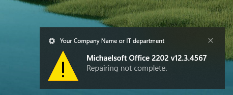
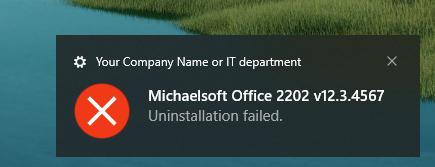

# PSADT.ToastNotification 1.0
Extension for PowerShell App Deployment Toolkit that replace all the windows and dialogs with Toast Notifications with a lot of visual and functional improvements.

## Features
- Administrative rights not needed.
- Wraps the original functions, so no script modification needed.
- SYSTEM raised Toast Notifications can interact with logged in no Administrator user.
- Ability to interact with the notifications using events or protocols.
- Can search for closing apps using wildcards.
- Can search for closing apps based on windows title or process path using wildcards.
- Added array of never kill applications (even if added for closing).
- Added array of never block applications (they can be killed but not blocked).
- Limit functions timeout to InstallationUITimeout.
- Ability to use MUI cache applications name if exists.
- Highly customizable Toast Notification visual schemes.
- Dynamically update running applications with icons and extended applications information.
- Fallback to original Windows Forms and dialogs if any error occurs.
- New dedicated strings with multilanguage support.

## Disclaimer
```diff
- Test the functions before production.
- Make a backup before applying.
- Check the config file options description.
- Run AppDeployToolkitHelp.ps1 for more help and parameter descriptions.
```

## Functions (wrappers) and improvements
### Show-InstallationWelcome
1.  Now you can search for processes using `like` operator. If you include any wildcard character, the evaluating operator will be `-like` instead of `-eq`. The search object `AcroRd*=Adobe Acrobat Reader` matches 32/64 bits version of the application, only **currently running processes** will be added to the `$ProcessObjects`. See [about Comparison Operators - PowerShell | Microsoft Learn](https://learn.microsoft.com/en-us/powershell/module/microsoft.powershell.core/about/about_comparison_operators?view=powershell-7.3#-like-and--notlike).

2.   For windows title search use `title:...` as prefix, if any process window validates the filter it will be added to the `$ProcessObjects`. Wildcards supported, `title:*Adobe*` will add any process that is **currently running** and the title is like `*Adobe*`. No `title:...=Application Name` supported. See [about Comparison Operators - PowerShell | Microsoft Learn](https://learn.microsoft.com/en-us/powershell/module/microsoft.powershell.core/about/about_comparison_operators?view=powershell-7.3#-like-and--notlike).

3.   For process path search use `path:...` as prefix, all the currently running processes validating the filter will be added to the `$ProcessObjects`. Wildcards supported, `path:$($env:ProgramFiles)\*Office*\*` will add any process that is **currently running** and the path is like `$($env:ProgramFiles)\*Office*\*`. No `path:...=Application Name` supported. See [about Comparison Operators - PowerShell | Microsoft Learn](https://learn.microsoft.com/en-us/powershell/module/microsoft.powershell.core/about/about_comparison_operators?view=powershell-7.3#-like-and--notlike).

4.  The closing applications evaluation removes processes that are included in `CriticalProcesses_NeverKill`, they won`t be added and a warning appears in console/log:

	

5. Internal function mechanism is kept for backward compatibility but, if the switch `-PersistPrompt` is not present, the user can dismiss or close the notification and a `Timeout` result is returned.

6.  If the `-BlockExecution` switch is used, any process included in `CriticalProcesses_NeverBlock` won`t be added for blocking and a warning appears in console/log:

	

<table>
<tr>
<td width="34%">

https://user-images.githubusercontent.com/13755139/218114492-0945ccb6-7de3-4f07-a6b0-2b37b311759a.mp4
</td>
<td width="33%">

https://user-images.githubusercontent.com/13755139/218115748-3537e7db-c9d9-4138-813c-102d3c8ce890.mp4
</td>
<td width="33%">

https://user-images.githubusercontent.com/13755139/218121541-5cbe46ca-c5eb-44bf-8095-9fdeb56d1f15.mp4
</td>
</tr>
</table>

### Show-BalloonTip
1. Shows a long duration Toast Notification if the `$BalloonTipTime` is greater than `10000` ms.

2. No need to call any external script, the Toast Notification always shows itself like if `$NoWait` was `$true`.

3. For more options see the [Customizable visual style](#customizable-visual-style) section.

<table style="width:100%">
<tr>
<td rowspan="2" width="50%">


</td>
<td>


</td>  
</tr>
<tr>
<td>


</td>
</tr>
</table>

### Show-DialogBox
1. The buttons get the translated string using the Data Extraction Extension to match the user language, the `InstallationUI_LanguageOverride` is omitted like original dialog box.

2.  If the `$Timeout` is bigger than `$configInstalltionUITimeout` you can use `LimitTimeoutToInstallationUI` config option to limit the timeout.

3. You can use `ShowAttributionText` config option to show a subtle text indicating the auto-dismiss timeout.

4. For more options see the [Customizable visual style](#customizable-visual-style) section.

<table>
<tr>
<td width="50%">

https://user-images.githubusercontent.com/13755139/218116614-dd4f3270-ae05-4b53-9722-4359cd265871.mp4
</td>
<td width="50%">


</td>
</tr>
</table>

### Show-InstallationRestartPrompt
1.  The shutdown command calls `shutdown.exe /r /f /t $SilentCountdownSeconds` instead of `Restart-Computer` since sometimes the cmdlet does not work.

2. Ability to show a warning icon by using `InstallationRestartPrompt_ShowIcon` config option.

3. You can use `ShowAttributionText` config option to show a subtle text indicating the auto-restart timeout.

4. If the parameter `$NoCountdown` is `$false` the Toast Notification will show a progress bar with the timeout to auto-restart.

5. Closing or dismissing the Toast Notification works like the `Minimize` button.

6. For more options see the [Customizable visual style](#customizable-visual-style) section.

<table>
<tr>
<td width="50%">

https://user-images.githubusercontent.com/13755139/218117049-cf1282e1-883b-4276-a776-d3ebf6e7634b.mp4
</td>
<td width="50%">

https://user-images.githubusercontent.com/13755139/218116985-35b297ae-59a4-4300-853a-5995a21b539e.mp4
</td>
</tr>
</table>

### Show-InstallationPrompt
1.  If the `$Timeout` is bigger than `$configInstalltionUITimeout` you can use `LimitTimeoutToInstallationUI` config option to limit the timeout.

2. Asynchronously behavior maintained like original function.

3. You can use `ShowAttributionText` to show a subtle text indicating the auto-dismiss timeout.

4. For more options see the [Customizable visual style](#customizable-visual-style) section.

<table>
<tr>
<td width="50%">

https://user-images.githubusercontent.com/13755139/218117363-970e5911-d05c-42a3-af80-2576c2e273cb.mp4
</td>
<td width="50%">

https://user-images.githubusercontent.com/13755139/218117418-fca32b08-f578-422e-84e9-f1c56faeca38.mp4
</td>
</tr>
</table>

### Show-InstallationProgress
1.  Defines the new variable `InstallationProgressFunctionCalled` that works like a switch indicating that `Close-InstallationProgress` should be called.

2. You can use `ShowAttributionText` config option to show a subtle text indicating the deployment progress message.

3. You can use `InstallationProgress_ShowIndeterminateProgressBar` config option to show an indeterminate progress bar.

4. For more options see the [Customizable visual style](#customizable-visual-style) section.

<table style="width:100%">
<tr>
<td rowspan="2" width="50%">

https://user-images.githubusercontent.com/13755139/218117746-49951415-f223-4f23-b874-99bcd6ea8b1a.mp4
</td>
<td>

https://user-images.githubusercontent.com/13755139/218117926-47b6bd79-f69c-4b2e-a162-f3dd8b1f596e.mp4
</td>  
</tr>
<tr>
<td>

https://user-images.githubusercontent.com/13755139/218118541-446c5c0a-9de7-4d84-9137-e19a1dba1ae4.mp4
</td>
</tr>
</table>

## Internal functions (wrappers) and improvements
### Get-RunningProcesses
1.  The function has changed, now it receives a `[PSCustomObject[]]` as input, backward compatibility kept.

2.  If any `CriticalProcesses_NeverKill` matches any process name or filters, it won`t be added and a warning appears in console/log:

	

3.  The output object array contains the process name, description, path and company.
### Show-WelcomePrompt
1.  If you do not like the **Continue** button string like me, you can use `WelcomePrompt_ReplaceContinueButtonDeploymentType` and now the text will show the translated strings of `Install`, `Repair` or `Uninstall` based on the deployment type of the script.

2.  If the `$CloseAppsCountdown` is bigger than `$configInstalltionUITimeout` you can use `LimitTimeoutToInstallationUI` to limit the timeout.

3. You can use `ShowAttributionText` to show a subtle text indicating the auto-deferral or auto-continue timeout.

4.  Ability to show more than the process name by using `ShowApplicationsIcons` and `ShowExtendedApplicationsInformation`.

5. By design the Toast Notification can only show up to 5 applications, additional ones will be grouped in the last item. You can reduce the amount of showed row by using `WelcomePrompt_MaxRunningProcessesRows`.

6.  The new strings react to the deployment type showing correctly if the application is running an `Installation`, `Repairing` or `Uninstallation` process and the translated string will be integrated in the showed text as well as the count of running applications to close.

7. For more options see the [Customizable visual style](#customizable-visual-style) section.
### Close-InstallationProgress
1. Wraps the original function but removes any background event or job.

2.  The original function is only called if the `Show-InstallationProgress` function was used before.
### Exit-Script
1. Wraps the original function but removes any created variable before.
### New-BlockExecutionToastNotificationTemplate
1. Creates the Toast Notification template that will be raised when a blocked application tries to run.

2.  Puts a list at the bottom of the Toast Notification showing the blocked applications.

3.  The Toast Notification shows which applications is being `installed`, `repaired` or `uninstalled` in the title.

4. For more options see the [Customizable visual style](#customizable-visual-style) section.
### Show-BlockExecutionToastNotification
1. Shows a previously created Toast Notification if any blocked application tries to run.

2.  Ability to show more than the process name by using `ShowApplicationsIcons` and `ShowExtendedApplicationsInformation`.

3. For more options see the [Customizable visual style](#customizable-visual-style) section.

<table width="50%">
<tr>
<td>

https://user-images.githubusercontent.com/13755139/218119133-639d152d-1b72-4026-8809-33f6fda7aa0c.mp4
</td>
</tr>
</table>

### Block-AppExecution
1.  The function has changed, now it receives a `[PSCustomObject[]]` as input, backward compatibility kept.

2. Changed the logic to detect if user has administrative rights.

3. Fixed a bug since version `3.8.4` with the task scheduled name.

4.  If the process that will be blocked has information in the *Image File Execution Option* registry key, it will be backed up and restored after the deployment process or reboot.

5.  Now the blocked application registry subkey are recreated volatile, if any error occurs, with a logoff/reboot all will be unlocked (the original scheduled task is no longer needed but kept for backward compatibility). See [PSADT.VolatilePaths Extension](https://github.com/LFM8787/PSADT.VolatilePaths)

6.  The remove blocked application scheduled tasks auto-delete itself after running.

7.  New scheduled task that restores the backed up *Image File Execution Option* per process that auto-deletes itself after execution.

8. Uses new cmdlets to register the scheduled tasks.

9.  The users who tries to run a blocked application is registered in log by default.

10. Minor backward compatible changes to the VBS script to capture the blocked application process.
### Unblock-AppExecution
1. Changed the logic to detect if user has administrative rights.

2.  Tries to remove the Debugger property per process, but if any process remains blocked, the scheduled task will retry hourly.

3. Restores the backed up *Image File Execution Option* per process by calling the scheduled task created.
## Internal functions
`This set of functions are internals and are not designed to be called directly`
* **New-DynamicFunction** - Defines a new function with the given name, scope and content given.
* **New-ToastNotificationAppId** - Registers the application identifier in registry.
* **New-ToastNotificationProtocol** - Registers the protocol in registry.
* **New-ToastNotificationProtocolCommandFile** - Creates a new file with the script used by the protocol.
* **Remove-ToastNotificationAppId** - Removes an application identifier from the registry.
* **Remove-ToastNotificationProtocol** - Removes a protocol from the registry.
* **Compare-ToastNotificationAppId** - Compares and verifies the application identifier data in the registry.
* **Compare-ToastNotificationProtocol** - Compares and verifies the correct operation of the protocol.
* **Test-ToastNotificationAppId** - Unregister and register again the AppId properties in registry.
* **Test-ToastNotificationProtocol** - Unregister and register again the protocol properties in registry.
* **Test-ToastNotificationVisible** - Determines if the previously raised notification is visible.
* **Test-ToastNotificationAvailability** - Determines whether the application identifier can raise notifications.
* **Test-ToastNotificationExtension** - Performs several tests to determine if notifications can be displayed.
* **Get-ToastNotificationResult** - Obtains the result of the execution and/or test of the protocol.
* **Remove-ToastNotificationResult** - Removes any previous result when using protocol.
* **Clear-ToastNotificationHistory** - Clear previously shown notifications from history.
* **Register-WrappedToastNotificationEvent** - Register a WinRT event by wrapping it in a compatible object.
* **Register-ToastNotificationEvents** - Registers the events triggered by the notification.
* **Unregister-ToastNotificationEvents** - Stops and removes previously registered events.

## Configuration File
General options and extended configuration for the wrapped functions:

* **WorkingDirectory**: A valid directory or $variable. Will be created if not exists, will use $dirAppDeployTemp if not valid.
* **TaggingVariable**: A not null tag or $variable. Will use $installName if empty/null.
* **ProtocolName**: Name of the protocol with which the commands will be launched. Will use "psadttoastnotification" if empty/null. **CAUTION: do not use a known protocol as it can be overwritten in the registry!**
* **SubscribeToEvents**: Attempts to register events raised by the Toast Notification object.
* **LimitTimeoutToInstallationUI**: If any wrapped function timeout exceeds the defined in the XML configuration, use that value.
* **CriticalProcesses_NeverKill**: Processes that, even if they are included, will not be closed by the Show-InstallationWelcome function.
* **CriticalProcesses_NeverBlock**: Processes that, even if they are included, will not be blocked by the Block-AppExecution function.
* **InstallationWelcome_AlwaysParseMuiCacheAppName**: Prefer MuiCache application name over -CloseApps description given.
* **WelcomePrompt_MaxRunningProcessesRows**: Maximum number of rows with running applications in the Toast Notification. Integer number between 1 and 5.
* **WelcomePrompt_ShowCloseMessageIfCustomMessage**: Shows the message warning that applications should be closed after the custom message.
* **WelcomePrompt_ReplaceContinueButtonDeploymentType**: Shows the deployment type action instead of the 'Continue' label in the button.
* **BlockExecution_TemplateFileName**: Name of the template that contains the blocked applications notification.
* **InstallationProgress_ShowIndeterminateProgressBar**: Defines if a progress bar is displayed simulating a loading or waiting state.
* **InstallationRestartPrompt_ShowIcon**: Shows a warning icon in the restart notification.

Options used by the Application that raise the Toast Notification:
> The custom application identifier used to raise the Toast Notification is automatically registered system wide or per user and it is volatile, nothing remains in registry after logoff/reboot.

* **AppId**: Identifier of the application used to display the Toast Notification.
* **DisplayName**: Display name on Toast Notification used to display it.
* **IconUri**: Location of the icon to display in the notification.
* **IconBackgroundColor**: Icon background color.
* **ShowInSettings**: Allow registered application to be shown in Settings.
* **AllowContentAboveLock**: Allow Toast Notifications to show its content on lock screen.
* **ShowInActionCenter**: Allow Toast Notifications to stay in the Action Center.

## Customizable visual style
Before editing the Toast Notification visual style see [App notification content - Windows apps | Microsoft Learn](https://learn.microsoft.com/en-us/windows/apps/design/shell/tiles-and-notifications/adaptive-interactive-toasts?tabs=appsdk)
> Not all the Toast Notifications included in the extension have the same configuration options.

* **UpdateInterval**: Interval in seconds at which the notification is updated. Integer number between 1 and 10.
* **ShowAttributionText**: Shows a small text indicating the automatic action of the toast notification when there is no countdown.
* **ImageHeroShow**: Defines if the top header image of the notification is shown.
* **ImageHeroFileName**: Top header image filename and extension, located in the .\SupportFiles\PSADT.ToastNotification folder.
* **ImageAppLogoOverrideShow**: Defines if the internal image of the notification is shown.
* **ImageAppLogoOverrideFileName**: Internal image filename and extension, located in the .\SupportFiles\PSADT.ToastNotification folder.
* **ImageAppLogoOverrideCircularCrop**: Defines if the internal image will be crop in a circular figure.
* **ShowApplicationsIcons**: Shows the applications icons (if apply).
* **ApplicationsIconsSize**: Sets the size of the applications icons, corresponding to 16x16, 32x32 and 48x48 at 100% scale factor. Default**: ExtraLarge.
* **CollapseApplicationsIcons**: Reduces the applications icons margins (if apply).
* **ShowExtendedApplicationsInformation**: Shows extended information per application, like MainWindowsTitle, Description, Company (if apply).
* **ShowDialogIconAsAppLogoOverride**: Replaces the AppLogoOverride image with the Dialog icon (if apply).
* **DialogsIconsSize**: Sets the size of the icons used by dialogs, corresponding to 16x16, 32x32 and 48x48 at 100% scale factor. Default**: Large.
* **CollapseDialogsIcons**: Reduces the dialogs icons margins (if apply).
* **AudioSource**: Sound file to play when displaying the notification or any of the system defined.
* **AudioLoop**: Defines if the sound is played in an indefinite loop.
* **AudioSilent**: If this value is true, then no sound will be played.

<table>
<tr>
<td width="34%">


</td>
<td width="33%">


</td>
<td width="33%">


</td>
</tr>
<tr>
<td width="34%">


</td>
<td width="33%">


</td>
<td width="33%">


</td>
</tr>
</table>

## How to Install
#### 1. Download and copy into Toolkit folder.
#### 2. Edit *AppDeployToolkitExtensions.ps1* file and add the following lines.
#### 3. Create an empty array (only once if multiple extensions):
```PowerShell
## Variables: Extensions to load
$ExtensionToLoad = @()
```
#### 4. Add Extension Path and Script filename (repeat for multiple extensions):
```PowerShell
$ExtensionToLoad += [PSCustomObject]@{
	Path   = "PSADT.ToastNotification"
	Script = "ToastNotificationExtension.ps1"
}
```
#### 5. Complete with the remaining code to load the extension (only once if multiple extensions):
```PowerShell
## Loading extensions
foreach ($Extension in $ExtensionToLoad) {
	$ExtensionPath = $null
	if ($Extension.Path) {
		[IO.FileInfo]$ExtensionPath = Join-Path -Path $scriptRoot -ChildPath $Extension.Path | Join-Path -ChildPath $Extension.Script
	}
	else {
		[IO.FileInfo]$ExtensionPath = Join-Path -Path $scriptRoot -ChildPath $Extension.Script
	}
	if ($ExtensionPath.Exists) {
		try {
			. $ExtensionPath
		}
		catch {
			Write-Log -Message "An error occurred while trying to load the extension file [$($ExtensionPath)].`r`n$(Resolve-Error)" -Severity 3 -Source $appDeployToolkitExtName
		}
	}
	else {
		Write-Log -Message "Unable to locate the extension file [$($ExtensionPath)]." -Severity 2 -Source $appDeployToolkitExtName
	}
}
```

## Requirements
* Powershell 5.1+
* PSAppDeployToolkit 3.8.4+
* [PSADT.VolatilePaths Extension](https://github.com/LFM8787/PSADT.VolatilePaths)
* [PSADT.DataExtraction  Extension](https://github.com/LFM8787/PSADT.DataExtraction)

## Multilanguage support progress (feel free to upload translated strings):
* 🇺🇸 100%
* 🇩🇰 0%
* 🇫🇷 0%
* 🇩🇪 0%
* 🇮🇹 0%
* 🇯🇵 0%
* 🇳🇴 0%
* 🇳🇱 0%
* 🇵🇱 0%
* 🇵🇹 0%
* 🇧🇷 0%
* 🇪🇸 100%
* 🇸🇪 0%
* 🇸🇦 0%
* 🇮🇱 0%
* 🇰🇷 0%
* 🇷🇺 0%
* 🇨🇳 (Simplified) 0%
* 🇨🇳 (Traditional) 0%
* 🇸🇰 0%
* 🇨🇿 0%
* 🇭🇺 0%

## External Links
* [PowerShell App Deployment Toolkit](https://psappdeploytoolkit.com/)
* [PSADT.VolatilePaths Extension](https://github.com/LFM8787/PSADT.VolatilePaths)
* [PSADT.DataExtraction  Extension](https://github.com/LFM8787/PSADT.DataExtraction)
* [about Comparison Operators - PowerShell | Microsoft Learn](https://learn.microsoft.com/en-us/powershell/module/microsoft.powershell.core/about/about_comparison_operators?view=powershell-7.3#-like-and--notlike)
* [App notification content - Windows apps | Microsoft Learn](https://learn.microsoft.com/en-us/windows/apps/design/shell/tiles-and-notifications/adaptive-interactive-toasts?tabs=appsdk)
* [Toast content schema - Windows apps | Microsoft Learn](https://learn.microsoft.com/en-us/windows/apps/design/shell/tiles-and-notifications/toast-schema)
